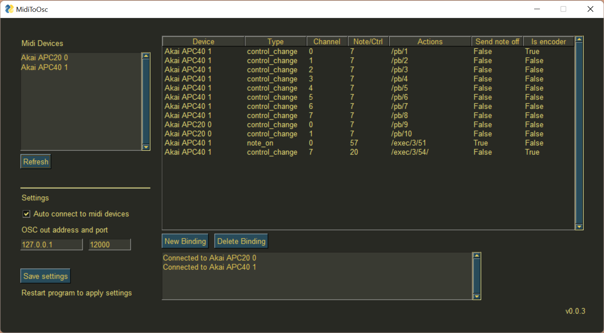

# Midi To OSC

Written by Hans van Arken

### Feature roadmap

- Build for Mac (If you would like to contribute by building and testing for OSX, that would be great!)
- Ability to send keystrokes as well as OSC
- Ability to select multiple bindings in table and make batch changes

### Known issues

Note: this software was written as a weekend project, it's not meant to be production ready. There is very little done in terms of error detection and recovery.

- If there is a crash while saving to the config file the file will probably become corrupt. If this happens create an empty config.json file with just `{}` as the content
